# Cadence vManager Jenkins Plugin

This plugin adds an ability to integrate with Cadence Verisium Manager over HTTP calls as a step in your build.

Plugin development and support is made by Cadence Design Systems. 

### Plugin Dependency

Please make sure you have **dashboard-view**, **workflow-step-api** & **credentials** 
plugin installed on your Jenkins before trying to install this plugin.

Also, in case you want to chart over the runs results, install the
**Junit Plugin** as well.

### About

Cadence Verisium Manager is exposing a REST API (vAPI) for performing automation
queries and updates for its regression/test and coverage data.  This
plugin enables you to add a remote execution for extracting runs
information, reports data or even collecting and launching sessions as part of your
build process.

This plugin can also work in a hybrid model - aka, keep your current way of
launching sessions using batch, while letting this plugin take over monitoring 
the session\'s progress, creation of JUnit and summary report.

## Features

-   Free-style job plugin (can perform all Verisium Manager vAPI call).
-   Support static/dynamic API calls
-   Support dynamic authentication per user id.
-   Special build step for performing launch of vsif files dynamically.
-   Support Dashboard portal for showing the session status.
-   Support the JUnit Report format for showing pass/fail runs charts.
-   Support the Jenkins Pipeline Step API.
-   Support the ability to delete sessions with every manual/automatic
    build removal (plugin ver 2.5.2 and above).
-   Adds a link within the project page for direct access to the
    Verisium Manager web analysis (post-build action).
-   Adds a table of sessions within the project\'s page to track the
    session\'s history and give high level overview about the progress
    (post-build action).
-   Adds an ability to embed the Verisium Manager Summary Report within Jenkins
    as part of the build page.
-   Adds an ability to send Verisium Manager Summary Report to dynamically
    selective users at the end of the regression.
-   Support Collect Mode.

## Configuration

After installing the plugin you\'ll get two new steps in the build step
selection.

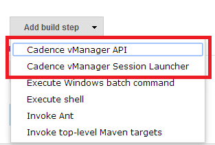\
[*A new step types*]

-   Choose \"**vManager API**\" if you need a free-style vAPI call to
    sends dynamic json input and receive a json output.
-   Choose \"**vManager Session Launcher**\" if you need to add a step
    for remote launching vsif (one or more).

")

-   Choose \"**vManager Post Build Actions**\" if you need analysis
    links and session triage table at the Project (job) and Build (run)
    level. (see pre-requisite below)
-   The Post Build Action **must have** the \'vManager Launcher\' part
    running as part of the build steps as a pre-requisites.

## Usage

##### **Verisium Manager API**

The step takes care for the following:

-   Authentication.
-   Defining the API call.
-   Defining the json input string for the API (static/dynamic).
-   Saving the API result (json format) into the workspace. 

The below is an example of defining a **static vAPI call** for getting a
list of runs with session id equals to 1 or 2:

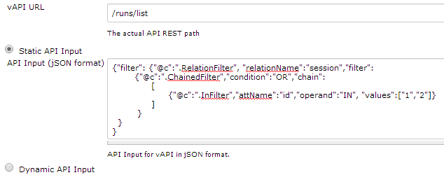\
[*Adding static vAPI input*]

The below is an example of defining a **dynamic vAPI call**:

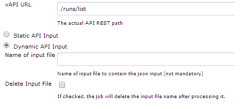\
[*Adding dynamic vAPI input*]

In case of a need in dynamically change the jSON input for the API per
job, the pre-job should place into the workspace directory a file with
the relevant jSON string to be sent to the vAPI.\
The input file should be place into the workspace directory. In case
this field is empty, The file name need to be:
\$BUILD\_NUMBER..\$BUILD\_ID.vapi.input

Please fill this field only in case you want to hard code the input
file name to be consist across all builds.

##### **Verisium Manager Session Launcher**

There are three modes for launching a session using the vManager Session
Launcher action:

-   **Launcher mode (default)** - choose this if you want the plugin to
    take over the actual launch operation with all the relevant setting,
    environment and parameters.
-   **Batch mode** - choose this mode if you want to launch the sessions
    yourself using shell/batch as part of a pre-step for this action.
-   **Hybrid mode** - This is the same as batch mode, but instead of having 
    you to write your own shell step, the plugin takes care for that automatically.

   
  

**Launcher mode**

The step takes care for the following:

-   Authentication.
-   Launching a vsif that is located on the NFS and is available to
    Verisium Manager Server.

The below is an example of defining a **static vsif call.**

\
[*Launching a static vsif file*]

The below is an example of defining a **dynamic launch call with
 multiple vsif files.**

\
[*Launching more than one vsif file
dynamically*]

In case of a need in dynamically selecting the vsif files to get
launched per job, the pre-job should place into the workspace directory
a file with the full paths of the relevant vsif files to be launched,
new line for each additional vsif file.\
The input file should be place into the workspace directory. In case
this field is empty, The file name need to be:
\$BUILD\_NUMBER.\$BUILD\_ID.vsif.input\
Please fill this field only in case, you want to hard code the input
file name, to be consist across all builds.

**Batch mode  (Continue from a pre-launched
session)**

The below is an example of defining a continues action from a previous
launched session:

This option is useful for those who wish to take benefit of their own
environment and scripts for launching sessions using batch, but still
want the benefit of having the Job waiting for the execution to end,
generates JUnit report, produce triage link, real time view of the
run\'s progress, etc\'.
In this option, there is an assumption that a pre-step (usually from
shell type) is taking over the session launch operation, and as such, in
order for this plugin to continue monitor those sessions - the session
names need to be exchange between the shell step and this
step.\
\
In case of a need to launch the sessions using batch as a pre-step to
this one, the pre-step should place into the workspace directory a file
with the session or session names that were launched - new line for each
session name.\
The input file should be place into the working directory. In case this
field is empty, The file name need to be:
\${BUILD\_NUMBER}.\${BUILD\_ID}.sessions.input\
Please fill this field only in case, you want to hard code the input
file name, to be consist across all
builds.\
\
The Verisium Manager plugin will look for the any of the input files mentioned
above, and query the server for their respective id automatically. From
that point and on, the flow continues as if the sessions were launched
by this plugin.

**Collect mode  (Continue post
\'collect\')**

The below is an example of defining a continues action from a previous
launched session:

This option is useful for those who wish to take advantage of this
plugin, but are not using the Verisium Manager Runner, and uses \"**collect**\"
mode instead. For such flow they can still benefit from generated JUnit
report, triage link, real time view of the run\'s progress, summary
report, etc\'.\
In this option, there is an assumption that a pre-step (usually from
shell type) is taking over the session launch operation (or collect),
and as such, in order for this plugin to continue monitoring those
sessions - the session names need to be exchange between the shell step
and this step.\
\
In case of a need to collect the sessions as a pre-step to this one, the
pre-step should place into the workspace directory a file with the
session or session names that were collected - new line for each session
name.\
The input file should be place into the working directory. In case this
field is empty, The file name need to be:
\${BUILD\_NUMBER}.\${BUILD\_ID}.sessions.input\
Please fill this field only in case, you want to hard code the input
file name, to be consist across all builds.\
\
the Verisium Manager plugin will look for any of the input files mentioned
above, and query the server for their respective id automatically. From
that point and on, the flow continues as if the sessions were collected
by this plugin.

**Important:**

please make sure \"**Wait for launched session to end**\" is checked
\'on\' within the plugin configuration.  Basically, your collected
sessions must be in a \"complete\" state within Verisium Manager.  The step will
only move FW once ALL your collected sessions are in a \"complete\"
state, and as such, this flag must be turned on.  You can still define
different states for the plugin to continue, if you like.\
\
The output of all IDs of the launched/collected sessions can be found
at:
\${BUILD\_NUMBER}.\${BUILD\_ID}.session\_launch.output

**Setting the build to wait till all session end execution:**

In case you want to hold the build till the session end its execution on
the Verisium Manager side, please check the \'wait for launched session to end\"
check box.

 

The above setup allow you to select how the build will behave in each
of the state where the session stop from
running:

**Continue**\
In case you select to continue, the build will assume (on the chosen
state) for a given session that it can continue and finish the wait on
this specific session.\
Please note that in case there are multiple sessions that are being
executed by this step, the build will wait till all sessions got into a
state that allow it to continue. 

**Ignore**\
In case you select to continue, the build will assume (on the chosen
state) for a given session that it can ignore the chosen state and keep
waiting for other state (until get the \'completed\'
state). 

**Fail**\
In case you select to fail, the build will assume (on the chosen state)
for a given session that it should mark this build as a failure
build. **Note:** If
you have multiple sessions on this build step, it is enough for one
single session to be marked as \'failed\' in order to mark the entire
build as a failed build. 

**Other Waiting Considerations**
1. When all sessions on this build step are having the state
\'completed\' the build will be marked as
success.
2. When the Verisium Manager server goes down, the build step will keep waiting
till the server will go back up. The build step will only change its
state based on sessions state changes.
3. If the session was manually deleted on the Verisium Manager server, before
reaching into final state, the build will be marked as a failure
build.
4. In any case, if the number of minutes waiting is bigger than the
timeout set here, the build will marked as a failed
build.

**Add support in Junit Plugin and Test
Charting**

The launch Session Plugin is also capable of placing an XML file in the
format of Junit Test Report.  The XML file name will
be **session_runs.xml** This format let \'Junit Plugin\"
chart over each build.  In order to activate
this:

1. After activating the \"wait for
session to end\", check the  \"Generate JUnit Result\" checkbox.  You
can also add custom Runs\' attributes to the report using this
configuration.

2. Install the plugin \"Junit Plugin\".
 Add a final build step to pick session_runs.xml
from the workspace.

This will give you a detail summary of the build, and an aggregated
charting over your entire builds.  See below.

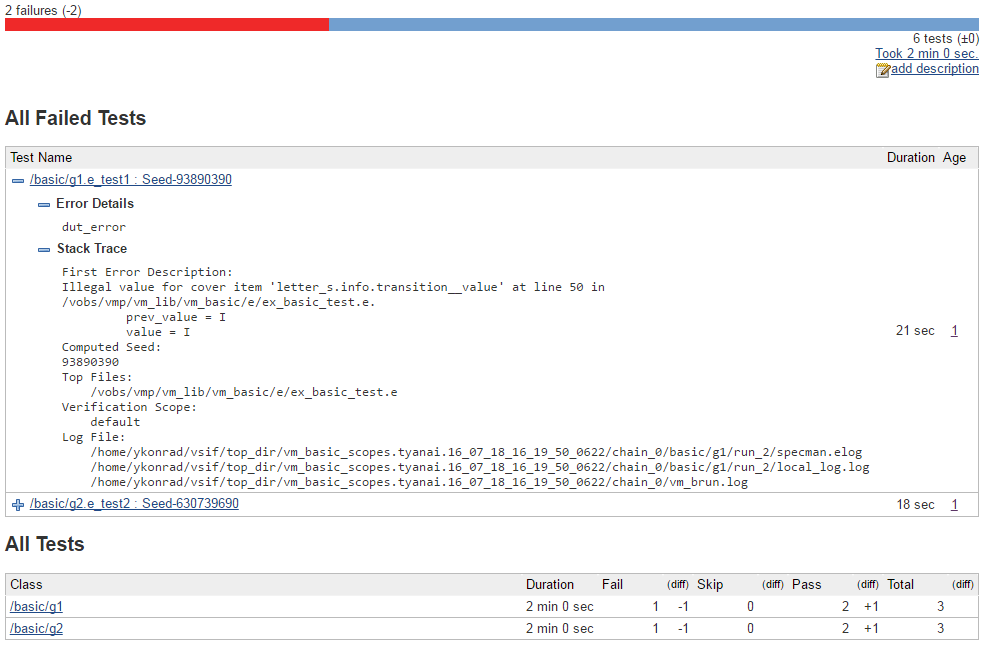

**Launching session using pipeline syntax**

The Verisium Manager Plugin also support the Pipeline syntax 
(you can generate the command below also using \"Pipeline Syntaxt\"):

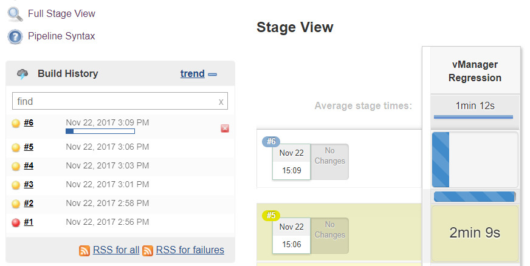

**Setting Jenkins to delete the build\'s sessions from vManager DB when
a build is being removed**

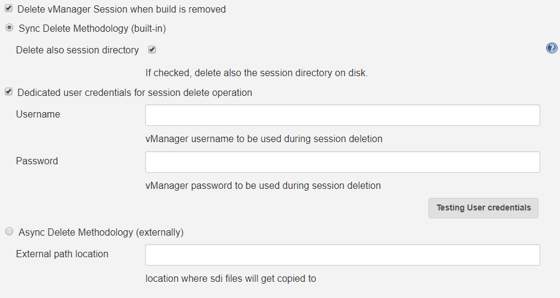

Choosing to delete Verisium Manager session during build removal, will trigger
an operation during manual/automatic deletion of a build, to deal with
the remote session/sessions that were created during that build on the
Verisium Manager DB.\
When this option is enabled the build will place an instruction file
(sdi.properties) within the job directory that specify the sessions to
get deleted, as well as other parameters - that will be used during the
delete operation.\
\
Builds that runs while this option is turned off, will not get effected
during removal, and will keep their sessions.\
\
You can choose between two methodologies: \
\
**Sync Delete Methodology (built-in)**\
In case you select the sync methodology, the plugin will call Verisium Manager
vAPI during the build removal process for deleting the sessions that
were created during that same build.\
With this option you can also supply a generic user/password to be used
for the delete operation, otherwise, the same user that was used during
the build will be picked automatically. \
Please note that the sync methodology is lacking two main aspects:
1. Since Jenkins ignores any exception thrown within the callback
functions of RunListener, the build will get deleted even if the session
failed to get deleted from Verisium Manager DB.
2. When the vAPI is down, it can take up to 20 seconds to finish the
operation (as it needs to wait till vAPI will be available) - the UX at
that time, might appears as sluggish to the end user.\
\
**Async Delete Methodology (externally)**\
In case you want to introduce a more robust approach (promising a
session deletion even if Verisium Manager Server is down, as well as faster UX),
you should use the async methodology.\
When Async Methodology is used, the callback function will not try to
delete the session, but instead will copy the sdi.properties file into
an external location of your choice. \
You should create an additional job, one that is triggered every 1
minute for scanning that directory (and trying to delete the relevant
sessions within these sdi files). To exclude the copy of the sdi files
during build removal, this flow is not managed by the plugin.\
Please note - defining an external directory location (in windows)
requires the use of forward slash instead of backslash.

## Dashboard

The Verisium Manager Plugin also support a new Dashboard portal using the
Dashboard-view plugin.  The new portal reflects the session\'s states
launched by the various builds:

\
To enable the new portal, select \"**vManager Latest Sessions**\" from
the Dashboard drop-down.

## Authentication

##### 

[*defining the connection settings*]

In case of a need in dynamically selecting the user name per job, the
pre-job should place into the workspace directory a file with single
line that contains the userid to be used.\
The file name should be: \$BUILD\_NUMBER.\$BUILD\_ID.user.input\
The job will pick the userid which is in the file, and connect to vAPI
using this userid and the vAPI secret key.

## Verisium Manager Post Build Actions

The Verisium Manager Plugin also supports a post-build action that brings:

-   High level view at the  session\'s states launched by the various
    builds:
-   Project level hyperlink that links to Verisium Manager Web Regression for
    the last build available for further analysis
-   Fine grained view of the session launched at the build (run) level
    (in case more than one session was launched during the regression)
-   Build level hyperlink that links to Verisium Manager Web Regression for the
    launched session for further analysis
-   Adds an ability to embed the Verisium Manager Summary Report within Jenkins
    as part of the build page.
-   Adds an ability to send Verisium Manager Summary Report to dynamically
    selective users at the end of the regression.

The action is also available for pipeline usage using the
function **vmanagerPostBuildActions()**

*Pre-requisite and limitation when using the post build
action:*
1.  The post-build action uses information that is gathered by the
    Launcher Action.  In order for the launcher action to generate the
    relevant information, please make sure \"Wait for launched session
    to end\" is checked on the **vManager Session Launcher** described
    above.
2.  Please make sure **vManager Session Launcher** step is used in your
    workflow prior of calling the post-build action.
3.  The new added links will **not** appear at the Project level until
    at least one build will get completed on the relevant project (since
    the date the post-action was added)
4.  In case of a Jenkins restart, the links at the Project level will
    not work until at least one build will get completed on the relevant
    project (since the time of restart).  This is because of a bug in
    the Jenkins Platform.

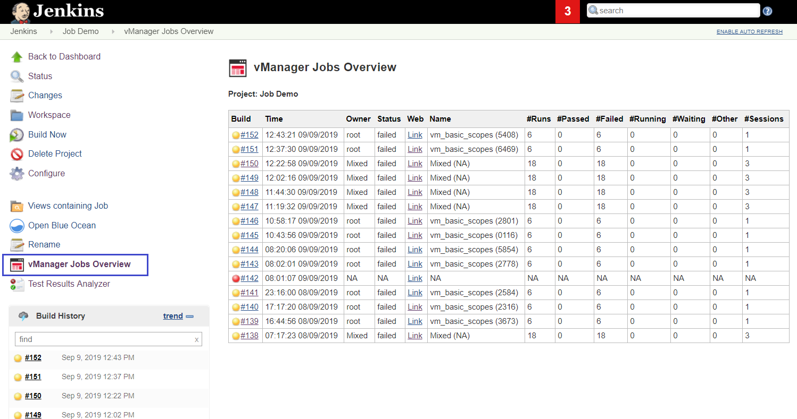

[*Session View at the Project level*]

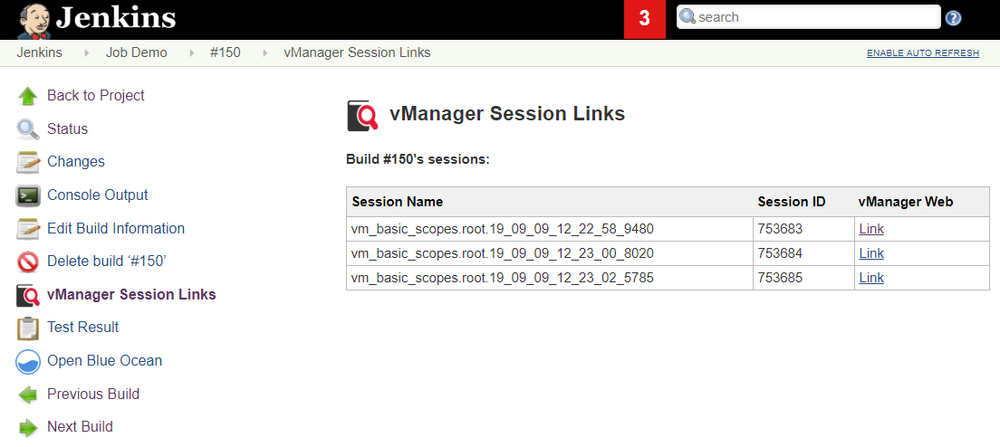

[*Session Triage View at the Build
level*]

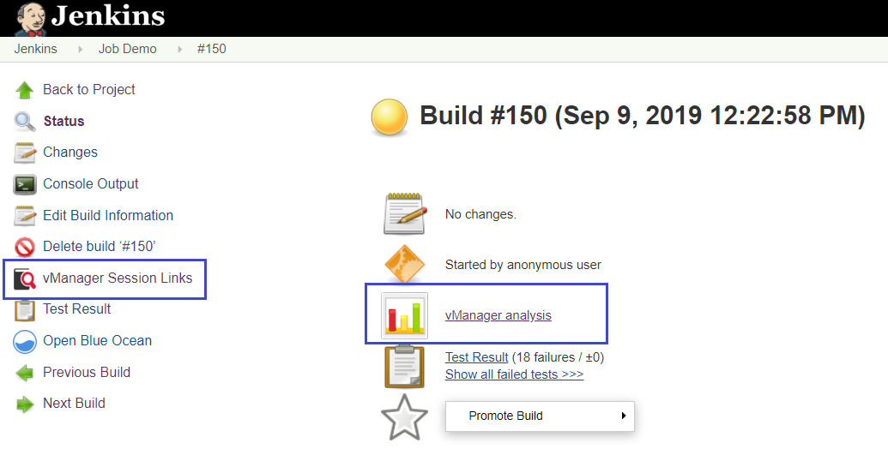

[*Links at the build level for doing analysis on the launched
session. (vManager Analysis)*]

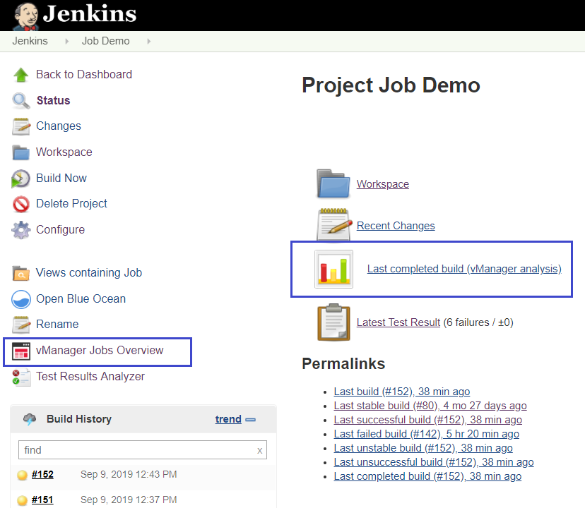
[*Links at the project level for doing analysis on the last completed
build. (vManager Analysis)*]

**Summary Report and Email**

*Security issue* was introduced in version 2.7.0. Please use version 2.7.1 and above if possible. If you are already using the below capability on 2.7.0, upgrading to 2.7.1 will add a new checkbox to get your consent regard SSL validation.  Please check for more information within the plugin\'s configurations.

1.  The Verisium Manager 2.7.0 post-build now have the ability to embed into
    Jenkins the Verisium Manager Summary Report.  This gives you the ability to
    have a quick view of your verification closure, vPlan progress and
    test based hierarchy aggregation right from the Jenkins build page
    using Javascript collapse/expand capability to view the hierarchies
    for any level needed.
2.  The post plugin also allows you to specify static/dynamic list of
    emails to get the summary report at the end of each build.

The Summary Report is part of the Plugin Advanced Functions, and is
supported as part of pipeline dsl or traditional post plugin.

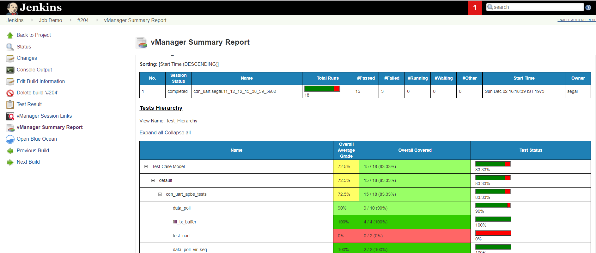

The summary report support 3 modes for bringing the report into the
Jenkins environment:

**Retrieve and Present Job Summary Report**

This mode covers most of the summary report settings, but not all using
some kind of pre-built menu.  It gives you the ability to define which
sections (tests, metrics, vplan) to include in the report, as well as
other advanced parameters within each section.  Using this mode is the
fastest way to try out the capability. 

If you wish to generate the report alongside the regression while keep updating the results
as the regression progress, you can use the pipeline \"parallel\" syntax while running the
\"Post Plugin\" in parallel to the "Regression Plugin" in a loop as long as the regression 
continues.  Make sure to run the \"Post Plugin\" only after the file session_status.properties
is available in your workspace directory.  (See  [here](./docs/examples/ongoing_report.js) for an example) This site was built using here.

**Retrieve and Present Job Summary Report (free vAPI syntax)**

In case a finer granularity is needed for the summary report such that
is not available within the menu approach, one can choose to work with
the full definition of the vAPI syntax for the
/reports/generate-summary-report vAPI.  Please make sure not to include
the \"rs\" part as it\'s built by the plugin dynamically based on the
session list that were launched during the specific build. 

**Important (**before and after 19.09 version**):**

In order to embed the summary report into Jenkins, a special format of
report is needed.  This special format can be achieved with the
additional vAPI flag \"Jenkins\":true that is only supported in vManager
19.09 onward. 

In order to make this feature available also for users who are currently
not using Verisium Manager \>19.09, please set the \"vManager Version\" drop
down accordingly (default to 19.09), so that the plugin will know
parse/modify the report and make it Jenkins complaint.  The outcome in
both options is the same although there can be differences in the
performance of the overall operation.

**Email**

The email feature comes in this plugin is making use of the Verisium Manager
Server Email capability.  Please make sure that Sendmail package is
installed on your Linux machine where the Verisium Manager server is installed
if you would like to use this capability.

**Bring the summary report yourself (view mode only)**

As the vAPI runs under the Verisium Manager server account, it can introduce a
limitation when trying to get access to coverage or vPlan data.  In such
cases, the vAPI can\'t be used for getting the report, and the user have
the option to generate the report himself using batch command.  This
option is only available for users with Verisium Manager version **19.09** and
above as the report generated must have a very specific format that can
only be achieved by adding the flag \"-jenkins true\" within the batch
command -- which only supported starting 19.09.  In order for the plugin
to find the report and show it to the user - please place the report in
the following format within the job working directory: 
**\${BUILD\_NUMBER}.\${BUILD\_ID}.summary.report**

\"**Email**\" is not offered as part of this mode.

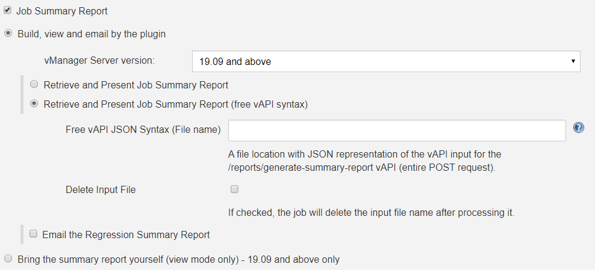

## Change Log

##### Version 4.0.0 (Feb 18, 2025)
-	Breaking Change - Only compatible with Jenkins version 2.479 and higher
-	Added Support in Java 17
-	Resolved the problem where the user password was being reset after every configuration save
-	Move the PostStep Report to stream directly from the server to the disk
-	Adjusted tables and icons to Jenkins new CSS
-	Enabled CD (Continuous Delivery)

##### Version 3.2.1.6 (Feb 8, 2024)
-	Fix - Exit criteria for a single session execution with state \"Failed\" didn\'t trigger when session ended

##### Version 3.2.1.5 (Jan 29, 2024)
-	Increased max number of session per jon from 100 to 10000 

##### Version 3.2.1.4 (Dec 6, 2023)
-	Added support in Token for the URL part

##### Version 3.2.1.3 (Aug 29, 2023)
-	Fixed Null Pointer Exception while trying to generate the JUnit XML File (when no Extra Attributes are wanted)

##### Version 3.2.1 (June 9, 2023)
-	Added support to call the Post-Build plugin multiple times within the same job without duplication
	of the sidebar links.

##### Version 3.2.0 (May 17, 2023)
-	Added support to evaluate env variable expression within the Post-Build Plugin.
-   Added support for 'vPlan in DB' as part of the summary report within the Post-Build Plugin.

##### Version 3.1.8 (March 16, 2023)
-	Added the ability to use Jenkins Credential for username/password (not supported on pipeline yet). 
-   Added default selection for radio buttons to minimize configuration complexity.

##### Version 3.1.7 (Nov 2, 2022)
-	Replace Apache HTTP deprecated usages with non-deprecated equivalents. 

##### Version 3.1.6 (Oct 28, 2021)
-	Add support in define variables for the launch operation. 
	This might break compatability if you are using pipeline.  Add:  
	defineVarible: false, defineVaribleFile:'', defineVariableType:'', defineVariableText:'' 
	to the plugin command to overcome it.

##### Version 3.1.5 (April 8, 2021)
-	Upgrading to Jenkins 2.277.1 Configuration Form Modernization.  
	This releases will fix the Jenkins "Configure System" saving failure.

##### Version 3.1.4 (March 11, 2021)

-	Added an exit condition for cases when user choose to ignore specific session states and continue to wait. (mostly
	common when session is changin state to Stop while not all runs finish thier execution). So far it was waiting 
	forever, and now the job will continue to the next step once there are no more runs on waiting or running state.
-	Added support in an auto-rerun post session comletion.  This adds one more minute to the overall Job time, 
	as the plugin checks for session completion two times in a row (to make sure a rerun did not start).

##### Version 3.1.3 (Dec 1, 2020)

-	Fix configuration indent.

##### Version 3.1.2 (Nov 19, 2020)

-	Removed the logging to the console log each time a copy is made from Agent to Controller.

##### Version 3.1.1 (Nov 17, 2020)

-	Changed implementation from ProcessBuilder to ProcStarter in batch execution.
-	Added parsing of batch vsif and script paths to match Jenkins env variables.

##### Version 3.1 (Nov 13, 2020)

-   Refactor the plugin to support Jenkins distributed execution across all OS types.
-	Removed the flag for none shared NFS, now the plugin assumes distributed topology as a default.
-	Added new option to launch session using batch (shell) if Jenkins Agent is running on Linux.
-	Fixed a bug in which an empty sessions.input file caused the plugin to monitor all sessions when using batch mode.

##### Version 3.0.7 (Oct 28, 2020)

-   Fixed the support in Controller and Agent running with different NFS access for the vAPI Plugin step. 

##### Version 3.0.6 (Sep 29, 2020)

-   Added support in CSH scripts for sourcing using Linux Users. 
-	Fixed a bug to support private SSH without selecting any other login method in addition.

##### Version 3.0.5 (Aug 24, 2020)

-   Remove description from the tables tooltip at the dashboard and vManager Job Overview. 

##### Version 3.0.3 (Aug 3, 2020)

-   Bug fix.  When choosing to use User SSH key, the pre-execution file was mandatory. 

##### Version 3.0.2 (Jan 26, 2020)

-   Added support in Verisium Manager session suspension/pause when user abort/cancel/stop Jenkins jobs. 

##### Version 3.0.0 (Nov 1, 2019)

-	Added support in a none shared NFS between controller and agent.
	Plugin can now consume/dump input/output files from build running
	on remote slaves.  (Not supported with Pipeline)
-	Added support in using Jenkins macros as part of the input params.
-	Added two new text area for supplying session env params and session
	attribute values without the need for an input file.
-   Library updates. Plugin now requires Jenkins version 2 and above
	with JDK 1.8 and above. 
-	New dependency - Token-Macro (version 2.3 and above)
-	Updated dependency - Dashboard-view (version 2.10 and above).
-	Remove apache-httpcomponents direct dependency (plugin size was also
	reduced).

##### Version 2.7.1 (Oct 11, 2019)

-   Security fix.  See above for information. 

##### Version 2.7.0 (Sep 26, 2019)

-   Added a support in a Summary Report post build.
-   Added support for sending Email with Summary report post build.

##### Version 2.6.0 (Sep 11, 2019)

-   Added a support in a session launching that is made by a pre-step
    using shell/batch.
-   Fixed missing UI in the pipeline syntax reference page.

##### Version 2.5.9 (Sep 10, 2019)

-   Added a link within the project page for direct access to the
    Verisium Manager web analysis (post-build action)
-   Added a table of sessions within the project\'s page to track the
    session\'s history and give high level overview about the progress
    (post-build action)
-   Added support for Verisium Manager HA architecture
-   Fix JUnit report to aggregate all runs from all session\'s that were
    launched as part of the build (before only the last session\'s runs
    were collected).  This is only relevant for build that launches
    more than one session.

##### Version 2.5.8 (Aug 28, 2019)

-   Added an option to overwrite vsif attribute values before launch.

##### Version 2.5.7 (Aug 21, 2019)

-   A fix for Dashboard view with jobs that lack the build area (there
    was an issue that caused the list of jobs to become empty within the
    Verisium Manager Latest Job plugin).

##### Version 2.5.6 (June 28, 2019)

-   Added an option to launch regression using the user\'s stored
    private SSH key.

##### Version 2.5.5 (April 15, 2019)

-   Added an option to mark Jenkins Job as \"Failed\" unless all the
    runs in the session passed.

##### Version 2.5.4 (Sep 27, 2018)

-   Added a support in controller/agent setup.  An ability to specify the
    controller workspace.

##### Version 2.5.3 (Feb 7, 2018)

-   Added a support to avoid appending the seed number to the test name
    in the JUnit XML report.

##### Version 2.5.2 (Dec 10, 2017)

-   Added a support for a session delete when a manual/automatic build
    removal is made.

##### Version 2.5.1 (Nov 22, 2017)

-   Added support in Pipeline.  You can now call Verisium Manager Launch using
    the Pipeline syntax.  (Requires Jenkins 2.19.1 and above.)
-   Verisium Manager Dashboard will now fetch historical data from the build
    directory instead of the workspace directory.  Once this plugin is
    updated, the Dashboard will only show historical jobs running from
    when the update occurred and on.

##### Version 2.4.9 (Sep 26, 2017)

-   Add an option to support the new 17.10 capability of sourcing an
    alias file for env variable per user before launching a session.

##### Version 2.4.7 (Feb 22, 2017)

-   Add an option to mark Jenkins Job as \"Failed\" when all runs in
    session are also failed.

##### Version 2.4.5 (Dec 9, 2016)

-   Add JUnit support in up to 100K run\'s for the XML report.
-   Fix special characters for JUnit XML.

##### Version 2.4.3 (Oct 26, 2016)

-   Add an option to mark build as \"Failed\" when all runs in session
    are also failed.

##### Version 2.4.2 (Sep 20, 2016)

-   Fixed a crash when saving the Jenkins Global Configuration screen.

##### Version 2.4 (Aug 23, 2016)

-   Changed Junit XML output to mark \'skip\' (yellow) on any run state
    other than \'passed\' or \'failed\'.

##### Version 2.3 (Aug 19, 2016)

-   Add session generated unique id as part of the session name in the
    dashboard.
-   Change the JUnit XML file name to be consisted across all builds.
-   Upgrade the build POM to Jenkins 2.14

##### Version 1.10 (July 24, 2016)

-   Add support for detailed error messages coming back from vAPI such
    as missing env variables.
-   Add support for JUnit Results XML even when build marked as failed.

##### Version 1.9 (July 18, 2016)

-   Add support in dashboard-view plugin.
-   Add support for JUnit Results XML

##### Version 1.8 (July 12, 2016)

-   Add support for the build step to wait till Session ends.
-   Create session\_list.output per job that contain the session ID
    launched.

##### Version 1.7 (July 5, 2016)

-   Add support for Session Launch with the user\'s Linux account
    credentials.

##### Version 1.6 (May 20, 2015)

-   Add support for VSIF variables.

##### Version 1.5 (May 14, 2015)

-   Add support in timeout configuration.

##### Version 1.4 (Sep 11, 2014)

-   Add support in PUT & GET API.

##### Version 1.3 (Aug 24, 2014)

-   Add support in vAPI over SSL.

##### Version 1.2 (Aug 14, 2014)

-   Update code for supporting the automatic launching of vAPI using
    Verisium Manager Server.

##### Version 1.1 (July 17, 2014)

-   Update code for more recent API

##### Version 1.0 (July 15, 2014)

-   Initial release

 
